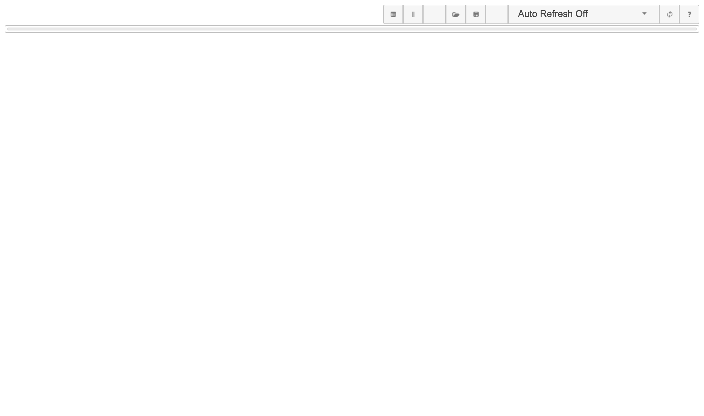
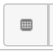
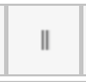

# TestDataTable GUI

## Initial Use
When you start TestDataTable for the first time there is no data, so the GUI will look like this:

## Adding a table
From the main screen click the create table button  to bring up the create table dialogue, enter the table name and click create.

## Adding a column
From the main screen, select the table you want to add a column to, click the add column button  to bring up the add column dialogue, enter the column name and click Add.

## Adding individual values

## Editing values

## Import Data

## Export Data
