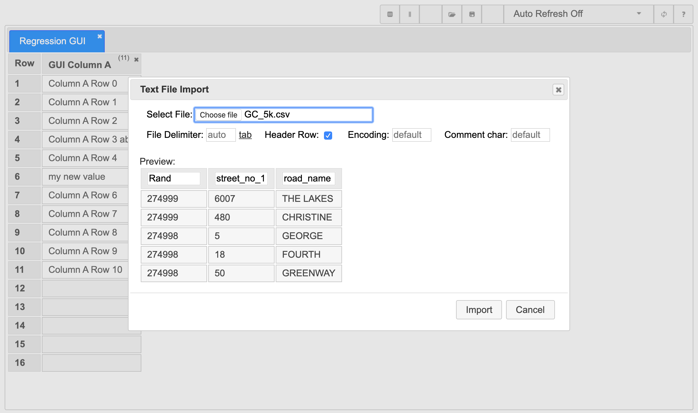

# TestDataTable GUI

## Initial Use
When you start TestDataTable for the first time there is no data, so the GUI will look like this:

||
|---|
|Initial Main Page|

## Adding a table
From the main screen click the create table button  to bring up the create table dialogue, enter the table name and click create.

||
|---|
|Create table dialogue|

## Adding a column
From the main screen, select the table you want to add a column to, click the add column button  to bring up the add column dialogue, enter the column name and click Add.

||
|---|
|Add column dialogue|

## Editing values
To enter edit mode on a data cell you need to click twice on that cell, noting that this is two(2) separate left clicks not a double click.

By using the two single click method it ensures no accidental editing of data and also allows you to double click the data cell to highlight the cell to copy the text without editing it.

|||
|---|---|
|Edit Mode on an empty cell|Edit Mode on a cell with data|

## Deleting a column
In the top right hand corner of a table column (next to the column count) is a x button, clicking this will bring up the delete column dialogue. Clicking the Delete button in this dialogue will remove the column from the table along with any values in the column.

> IMPORTANT NOTE: Use caution with this feature, as it can result in data loss. If unsure, use the data export feature first to make a backup of the table.

||
|---|
|Delete column dialogue|

## Deleting a table
In the top right hand corner of a table tab is a x button, clicking this will bring up the delete table dialogue. Clicking the Delete button in this dialogue will remove the table along with all columns and values in the table.

> IMPORTANT NOTE: Use caution with this feature, as it can result in data loss. If unsure, use the data export feature first to make a backup of the table.

||
|---|
|Delete column dialogue|

## Import Data
The data cell edit mode is great for adding or changing a few values, but often with testing you will want to use a large data sets that has come from a variety of sources e.g.:
- SQL extract from application under test
- Application interface file
- test data provided to you
- data you created/generated

TestDataTable provides an import option for delimited text files to help you with this. To import a text file click the File Import button  and adjust the settings in the dialogue until you are happy with the preview, then click Import.

||
|---|
|File Import dialogue|

||
|---|
|File Import dialogue after selecting a file|

||
|---|
|File Import dialogue unchecking the header row option|

## Export Data
