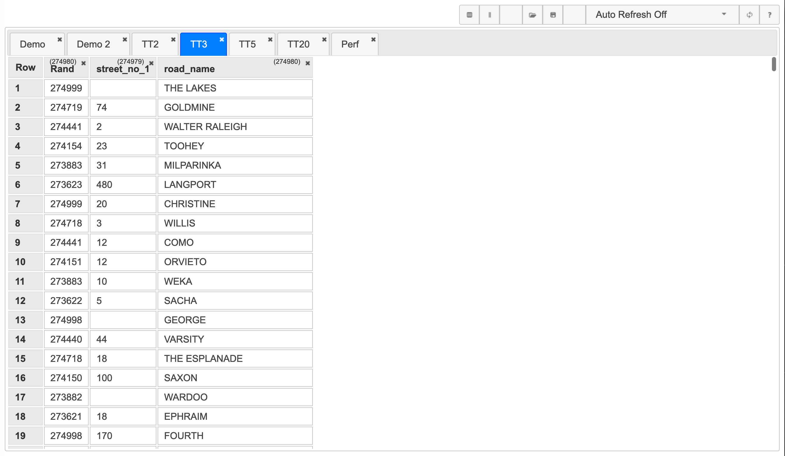
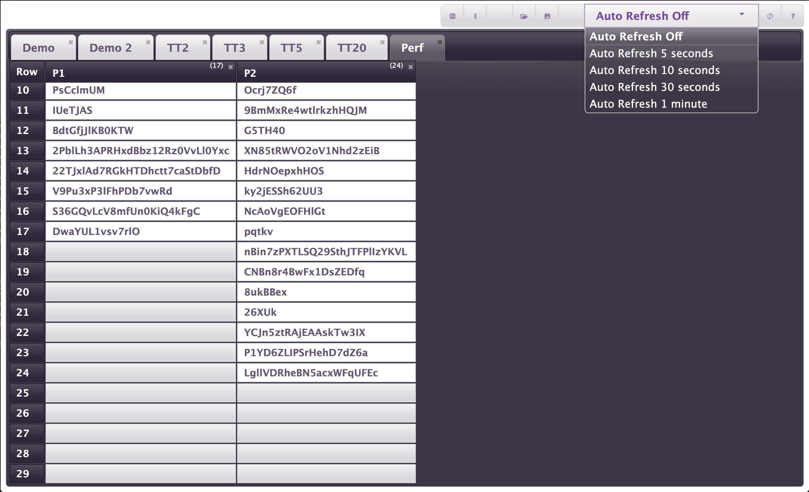
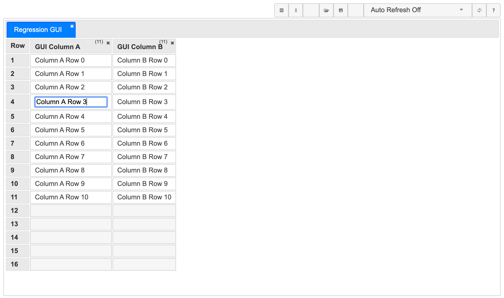

# TestDataTable GUI

## Main Page
When you start TestDataTable for the first time there is no data, so the GUI will look like this:

||
|---|
|Initial Main Page|

After you have used TestDataTable for a while the main page will have data to display:

|||
|---|---|
|Main Page In Use|Main Page showing table with over 270,000 records|

You can also use themes to change the appearance of TestDataTable to you needs or tastes e.g.:

|||
|---|---|
|JQueryUI Eggplant Theme|JQueryUI Sunny Theme|

See [Theming (Changing the colour scheme)](./InstallationAndConfiguration.md#theming-changing-the-colour-scheme) for details.

## Adding a table
From the main screen click the create table button  to bring up the create table dialogue, enter the table name and click create.

||
|---|
|Create table dialogue|

## Adding a column
From the main screen, select the table you want to add a column to, click the add column button  to bring up the add column dialogue, enter the column name and click Add.

||
|---|
|Add column dialogue|

## Editing values
To enter edit mode on a data cell you need to click twice on that cell, noting that this is two(2) separate left clicks not a double click.

By using the two single click method it ensures no accidental editing of data and also allows you to double click the data cell to highlight the cell to copy the text without editing it.

||
|---|
|Edit Mode on an empty cell|

||
|---|
|Edit Mode on a cell with data|

## Deleting a column
In the top right hand corner of a table column (next to the column count) is a x button, clicking this will bring up the delete column dialogue. Clicking the Delete button in this dialogue will remove the column from the table along with any values in the column.

> IMPORTANT NOTE: Use caution with this feature, as it can result in data loss. If unsure, use the <a href="#Export-Data" >data export feature</a> first to make a backup of the table.

||
|---|
|Delete column dialogue|

## Deleting a table
In the top right hand corner of a table tab is a x button, clicking this will bring up the delete table dialogue. Clicking the Delete button in this dialogue will remove the table along with all columns and values in the table.

> IMPORTANT NOTE: Use caution with this feature, as it can result in data loss. If unsure, use the <a href="#Export-Data" >data export feature</a> first to make a backup of the table.

||
|---|
|Delete table dialogue|

## Refresh
There are two options with refreshing the Main Page, Manual Refresh and Auto Refresh.

The Manual Refresh button , simply refreshes the page once when pressed.

The Auto Refresh menu below allows you to select various auto refresh intervals, or turn the auto refresh off (default)

> NOTE: Especially when dealing with large tables (over 100,000 rows) the auto refresh had the potential to lock up the browser when refreshing every 5 seconds and the refresh takes longer than 5 seconds to complete. So there is a protection mechanism built into the TestDataTable GUI so a refresh only runs if a previous refresh has completed. like wise pressing the Manual Refresh button multiple times will not run the refresh again unless the previous refresh has completed. If you switch tables while the refresh is running on the current table, the refresh will be stopped and then started again on the new table.

## Import Data
The data cell edit mode is great for adding or changing a few values, but often with testing you will want to use a large data sets that has come from a variety of sources e.g.:
- SQL extract from application under test
- Application interface file
- test data provided to you
- data you created/generated

TestDataTable provides an import option for delimited text files to help you with this. To import a text file click the File Import button  and adjust the settings in the dialogue above the preview, you can also change the column name in the preview if you want different column name from the ones in the file or if your file didn't have column names. when you are happy with the preview, then click Import.

||
|---|
|File Import dialogue|

||
|---|
|File Import dialogue after selecting a file|

||
|---|
|File Import dialogue unchecking the header row option|

||
|---|
|File Import dialogue tab delimiter option|

||
|---|
|File Import dialogue custom column name|

Once you click import the File Import dialogue will close and the File Import Progress dialogue will open, this dialogue will remain open until the import is complete, when complete the table will be refreshed in the main screen.

||
|---|
|File Import Progress dialogue - Loading|

||
|---|
|File Import Progress dialogue - in progress|

||
|---|
|File Import Progress dialogue - Complete|

||
|---|
|File Import Finished|

## Export Data
Like the Import Feature the Export Feature is available to help you manage your test data. To use this Feature click the  File Export button , then adjust the options in the dialogue until you are happy with the result in the preview, then click Save, this will close the File Export dialogue and then download the table as a text file with the name you provided. Depending on your browser determines what will happen next, as each browser handles file download differently.

||
|---|
|File Export dialogue|

||
|---|
|File Export dialogue unchecking the header row option|

||
|---|
|File Export dialogue Tab Delimiter option|

||
|---|
|File Export dialogue Pipe (\|) Delimiter option|
