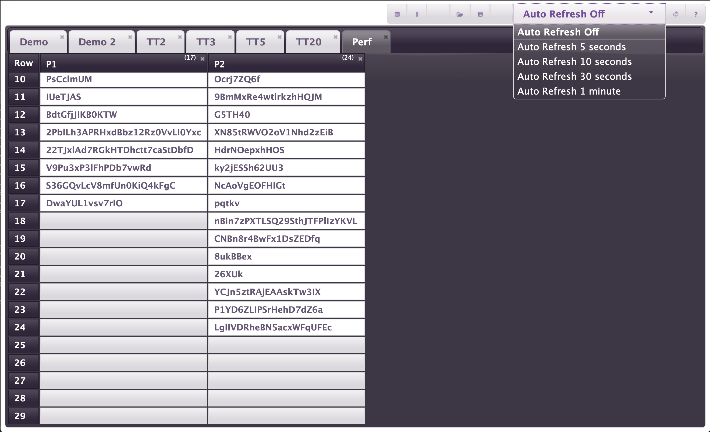
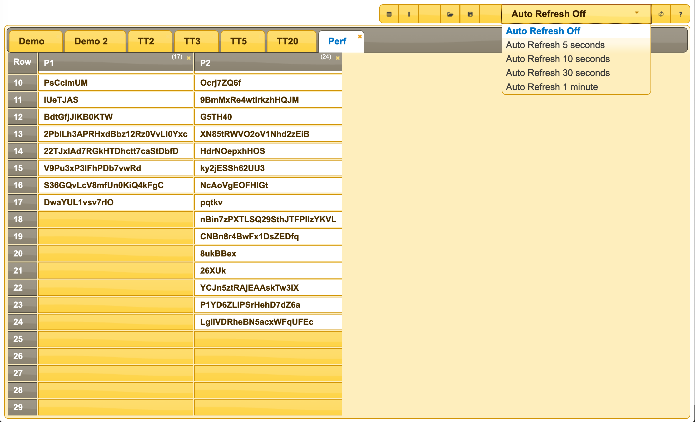

# TestDataTable Installation and Configuration

- [PIP Installation](#pip-installation)
- [Configuration](#configuration)
- [Command Line Interface](#command-line-interface)
- [Manual Installation (for TestDataTable Development)](#manual-installation)

TestDataTable is a Python Application and needs Python 3.7 or higher to run. The easiest and recommended way to install TestDataTable is to ensure you have a suitable python version and then use the Python Installer (PIP).

- Windows : Windows does not have python installed by default, you can check Add Remove Programs to see if it's installed, if not head over to the [Python Downloads Page](https://www.python.org/downloads/windows/).
- MacOS : MacOS usually has python installed, you can open a terminal and run `python3 -V` to check, if it's not installed or it's a version older than 3.7, head over to the [Python Downloads Page](https://www.python.org/downloads/macos/).
- Linux : Linux distributions usually have python installed, you can open a terminal and run `python3 -V` to check, if it's not installed or it's a version older than 3.7, consult your distribution's documentation on how to install it. Some Linux distributions don't include Python Installer (PIP), so you may also need to consult your distribution's documentation on how to install pip.

## PIP Installation

If you already have Python with pip installed, you can simply run the following command on a terminal (or command line) window:

```
pip install testdatatable
```

This should install all the dependancies for you, then you can start Test Data Table with the command:
```
testdatatable
```
Depending on your system this may require sudo.


Otherwise refer to the [manual installation instructions](#manual-installation).

## Configuration

The first time you run TestDataTable an ini file with the default configuration will be created. The location of this configuration file will be shown below the version on the terminal.

An example configuration file:

```
[Server]
bindip =
bindport = 80
datadir = <path to TestDataTable.py>
dbfile = TestDataTable.sqlite3

[Resources]
js_jquery = https://unpkg.com/jquery@latest/dist/jquery.min.js
js_jqueryui = https://code.jquery.com/ui/1.12.1/jquery-ui.min.js
css_jqueryui = https://code.jquery.com/ui/1.12.1/themes/base/jquery-ui.css
js_papaparse = https://unpkg.com/papaparse@latest/papaparse.min.js

```

If you change the configuration in the ini file, simply stop and start TestDataTable to take the new configuration.

### Server

These settings configure the core settings of TestDataTable.

#### bindip

If you are running TestDataTable on a server with multiple IP addresses and want to restrict the use of TestDataTable to only one of them, enter that IP address here. The Default configuration (blank) should listen on all available addresses.

#### bindport

If you want to run TestDataTable on a different port, then simply change the port number here. If you are changing the port number so that you can run multiple instances of TestDataTable, don't forget to change the [dbfile](#dbfile) setting as well as multiple instances of TestDataTable cannot share the same database file.

#### datadir

If you want TestDataTable to store it's database in a different location from the python file, then use this setting to configure that location.

#### dbfile

If you want TestDataTable to use a different file name for you TestDataTable database, use this setting to configure the file name to use. This is particularly useful if you need to run multiple instances of TestDataTable on the same machine, in this case don't forget to also change the port number with the [bindport](#bindport) option.

### Resources

These settings configure the javascript libraries used by the TestDataTable GUI. The default configuration uses internet locations for these libraries, however if you need to use TestDataTable on an internal network without internet access then you can install these libraries locally on the TestDataTable server in a directory with the TestDataTable.py file and then change the ini file to reference the local paths for these libraries. Here is an example of what that could look like:

```
[Resources]
js_jquery = ./Resources/jquery/3.4.1/jquery.min.js
js_jqueryui = ./Resources/jqueryui/1.12.1/jquery-ui.min.js
css_jqueryui = ./Resources/jqueryui/1.12.1/jquery-ui.css
js_papaparse = ./Resources/PapaParse-5.0.2/papaparse.min.js
```

#### JQuery
JQuery can be download from the [JQuery website](https://jquery.com/)

#### JQueryUI
JQueryUI can be download from the [JQueryUI website](https://jqueryui.com/)

#### PapaParse
PapaParse can be download from the [PapaParse website](https://www.papaparse.com/)

#### Theming (Changing the colour scheme)

The TestDataTable GUI colour scheme can be easily changed if you want to do so as all elements of the UI use the JQueryUI theming, so it is a simple matter of switching the jquery-ui.css to a different theme. This could be useful if you are running multiple instances of TestDataTable and want a quick visual way to distinguish them.

There are a number of themes provided in the [JQueryUI Theme Gallery](https://jqueryui.com/themeroller/#themeGallery) to use these provided themes you can simply change the /base/ part of the css_jqueryui url to the theme you want to use:

|||
|---|---|
|JQueryUI Eggplant Theme|JQueryUI Sunny Theme|
| css_jqueryui = https://code.jquery.com/ui/1.12.1/themes/eggplant/jquery-ui.css | css_jqueryui = https://code.jquery.com/ui/1.12.1/themes/sunny/jquery-ui.css |

Alternatively you can use the [JQueryUI Theme Roller](https://jqueryui.com/themeroller/) to create and download your own custom theme, if you do this you will need to reference the local js and css files similar to this:

```
; js_jqueryui = ./Resources/jquery-ui-1.12.1.custom/jquery-ui.min.js
; css_jqueryui = ./Resources/jquery-ui-1.12.1.custom/jquery-ui.css
```


## Command Line Interface

These command line options allow you to override the ini file configuration but do not update the ini file.

Additionally the debug (-g) levels 1-3 will give extra information on the console useful for troubleshooting your environment. debug levels above 5 are more for debugging the code and get very noisy so are not recommended for normal use.

```
$ python3 TestDataTable.py -h
Test Data Table Server
	Version v0.2.0-alpha
usage: TestDataTable.py [-h] [-g DEBUG] [-v] [-i INI] [-d DIR] [-e IPADDRESS]
                        [-p PORT]

optional arguments:
  -h, --help            show this help message and exit
  -g DEBUG, --debug DEBUG
                        Set debug level, default level is 0
  -v, --version         Display the version and exit
  -i INI, --ini INI     path to alternate ini file
  -d DIR, --dir DIR     Data directory
  -e IPADDRESS, --ipaddress IPADDRESS
                        IP Address to bind the server to
  -p PORT, --port PORT  Port number to bind the server to
```

## Manual Installation
This information is intended for TestDataTable Developers

- The TestDataTable machine needs to use a minimum of Python 3.7
> ThreadingHTTPServer feature of HTTPServer requires was added in Python 3.7

Additionally the following pip command might be needed if these are not already installed on your system:
```
pip* install configparser setuptools HTTPServer sqlite3worker
```
> setuptools (is required by HTTPServer)

\*some systems might need you to use pip3 and or sudo

After these components are installed you can clone this repository to your local machine, change to the repository directory and run:
```
python* TestDataTable.py
```
\*some systems might need you to use python3 or use the full path to the python executable.

To stop TestDataTable simply type Control-c in the command window where TestDataTable is running and it will shutdown cleanly.
