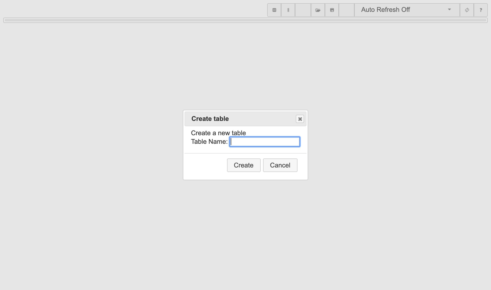
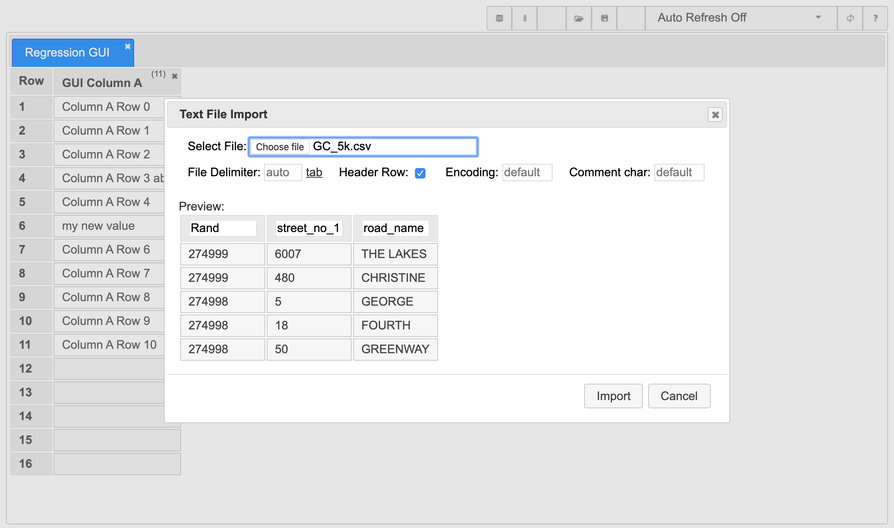
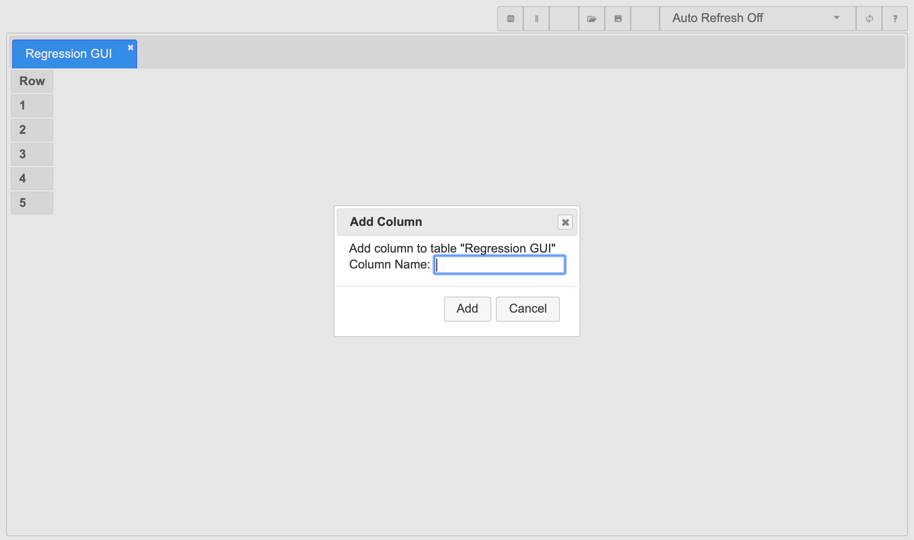

# TestDataTable

## About

TestDataTable is a web-based application that offers an alternative to static data sheets (text files, excel, etc.). When you use static data sheets, each test script is assigned parameter values from a dedicated set of values, values are either  not shared between test scripts or are duplicated in each script. In contrast, TestDataTable enables you to assign test data variable values from a single set of data to multiple scripts while allowing you to ensure each script has a unique data value. This may enable you to more accurately emulate a real-user environment.

Please refer to the [documentation](Doc/Index.md) for more information.

Some Screen Shots:

|||
|---|---|
|||

## Testing

The [Regression_Tests](Regression_Tests) folder contains the current Regression Test Suite, I would love to hear the results of running this suite against Test Data Table on your machine, especially a Window Machine (as I don't have one)

## Getting Help

- [TestDataTable Documentation](Doc/Index.md)
- [Discord](https://discord.gg/65E8KJakJP)
- [Reporting Issues / Known Issues](https://github.com/damies13/TestDataTable/issues)

## Donations

If you would like to thank me for this project please use this [PayPal.me](https://paypal.me/damies13/5) link, the $5 is a suggestion, feel free to change to any amount you would like.

<!-- If you do make a donation and would like me to prioritise a feature / issue send me a [quick message](mailto:damies13+TestDataTable@gmail.com) and let me know. -->
