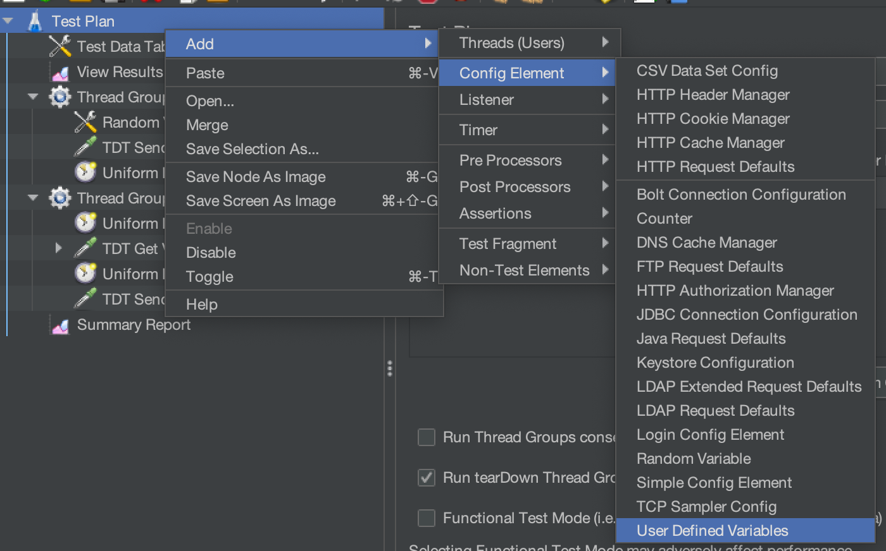
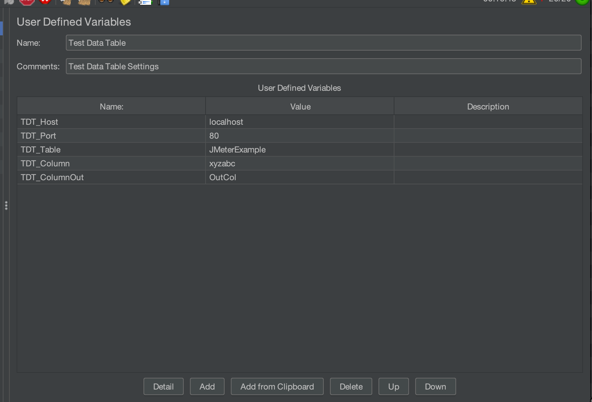
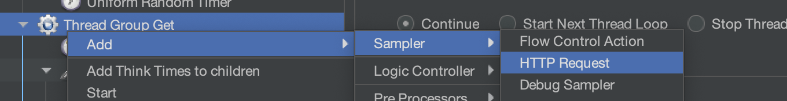
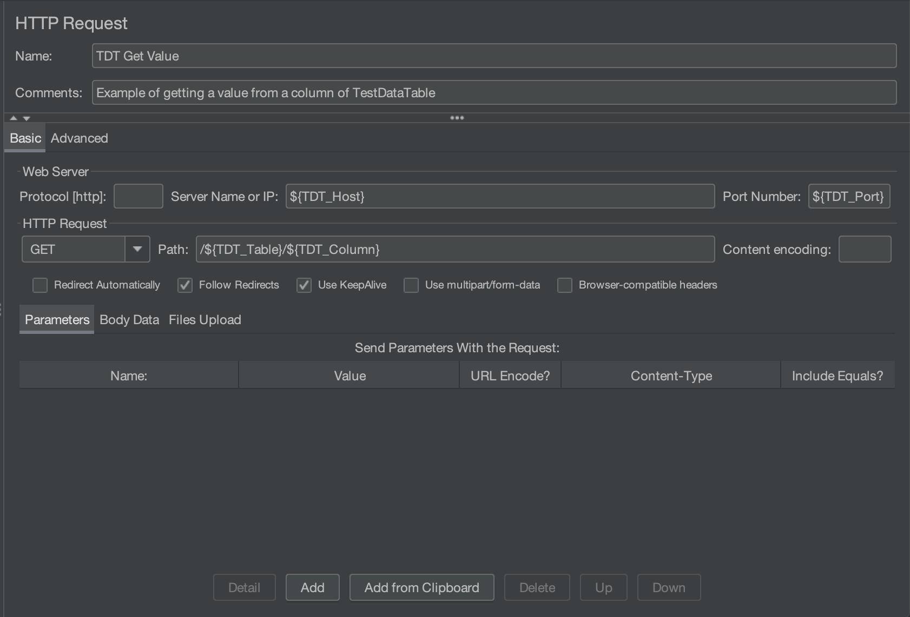
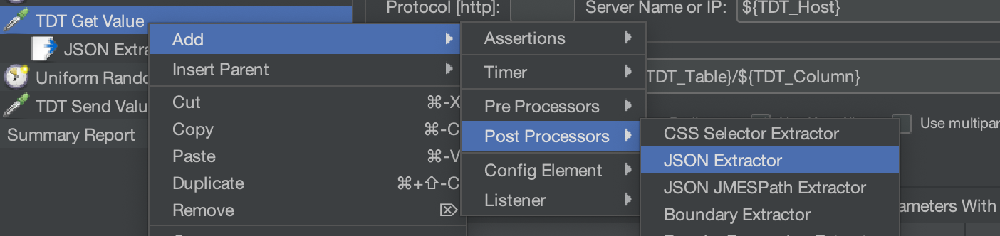
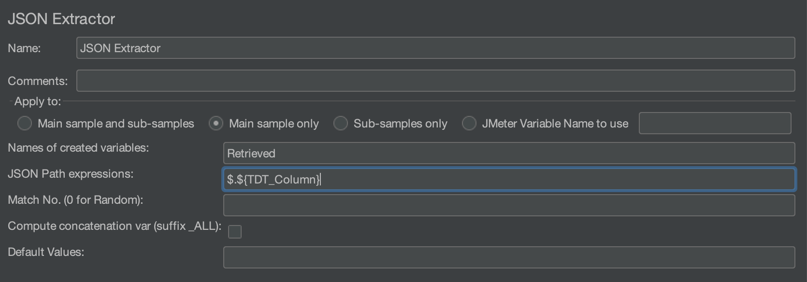
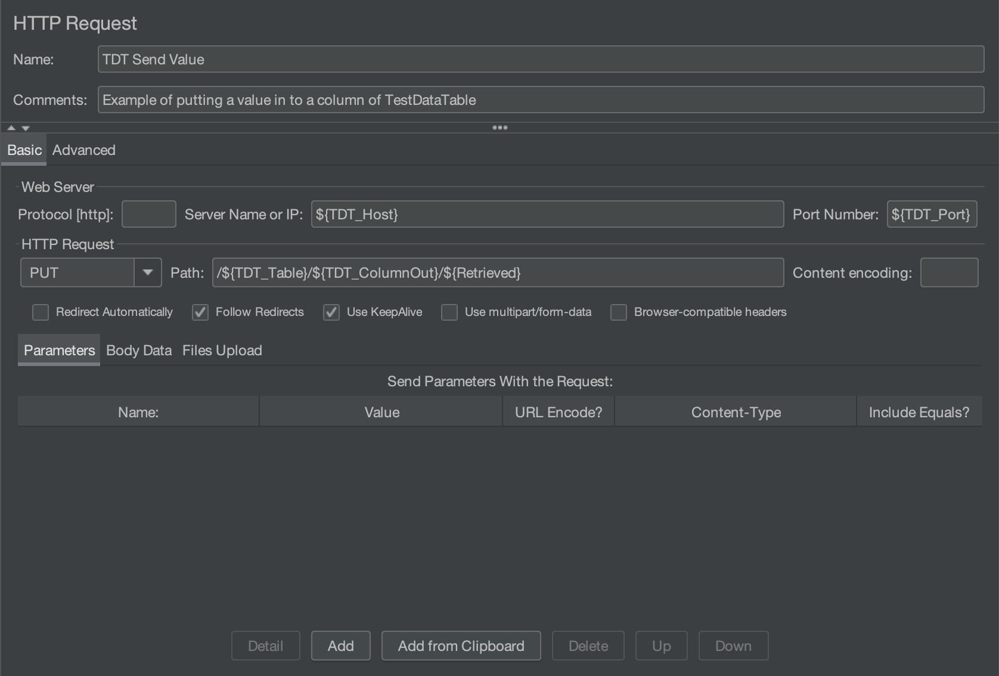

# TestDataTable for JMeter

The following is an example of setting up JMeter to use TestDataTable, you don't have to follow these steps exactly they are provided as an example.

1. Start by setting up some user defined variables, this will make your life easier if you need to change these.

	1. Right Click your test plan, select Add, Config Element, User Defined Variables

	

	

	

	1. Then set up some variables for Host, Port, Table and Columns 

1. For this example we will read the value from one column and return it to another column in the same table, whether you read and return to the same column, different column or only send to a column for you thread group will depend on the requirements of your application.

	1. Getting a value from a TDT column

		1. Right click your Thread Group and select Add, Sampler, HTTP Request

			

		1. Then configure the following settings

			- Name: Set this to something meaningful to you e.g. 'TDT Get Value' or 'Get value from column'
			- In the basic tab, under the Web Server heading

				* Server Name or IP Address: Set this to the host variable you set in the User Defined Variables, e.g. $\{TDT_Host\}
				* Port Number: Set this to the port variable you set in the User Defined Variables, e.g. $\{TDT_Port\}

			- In the basic tab, under the HTTP Request heading

				* From the dropdown menu select 'Get'
				* Path: Set this to /\<Table\>/\<Column\> for the table and column you want to get the value from, again it's a good idea to use the variables you defined in the User Defined Variables, e.g. /$\{TDT_Table\}/$\{TDT_Column\}

			- You can leave all other values default

				

		1. Next right click the HTTP Request Sampler and select Add, Post Processors, JSON Extractor

			

		1. Then configure the following settings

			- Names of created variables: Set this to a meaning variable name that you want to use in your thread group, e.g. Retrieved (I don't recommend using variables here unless you understand JMeter's variable evaluation)
			- JSON Path expressions: Set this to JSON path that gets the value you want, e.g. $.\<Column\> or use your User Defined Variable $.$\{TDT_Column\} \(JSON paths start with a '$.'\)

				

		1. Now you can use this variable created by the JSON Extractor in you Thread Group, e.g. $\{Retrieved\}

	1. Getting a value from a TDT column

		1. Right click your Thread Group and select Add, Sampler, HTTP Request

			

		1. Then configure the following settings

			- Name: Set this to something meaningful to you e.g. 'TDT Get Value' or 'Get value from column'
			- In the basic tab, under the Web Server heading

				* Server Name or IP Address: Set this to the host variable you set in the User Defined Variables, e.g. $\{TDT_Host\}
				* Port Number: Set this to the port variable you set in the User Defined Variables, e.g. $\{TDT_Port\}

			- In the basic tab, under the HTTP Request heading

				* From the dropdown menu select 'PUT'
				* Path: Set this to /\<Table\>/\<Column\>/\<Value\> for the table and column you want to get the value from, again it's a good idea to use the variables you defined in the User Defined Variables, e.g. /$\{TDT_Table\}/$\{TDT_Column\}/$\{Retrieved\}

			- You can leave all other values default

				

Also you can download [this example .jmx file](TDTExample.jmx) if you want to see some working examples.
