# TestDataTable for JMeter

The following is an example of setting up NeoLoad to use TestDataTable (TDT), you don't have to follow these steps or settings exactly they are provided as an example.

1. For this example we will read the value from one column and return it to another column in the same table, whether you read and return to the same column, different column or only send to a column for you thread group will depend on the requirements of your application.

	1. Getting a value from a TDT column

		1. Right click the Container or Transaction where you want to get the value(s) from TDT and select Insert as child, Request, HTTP Request
			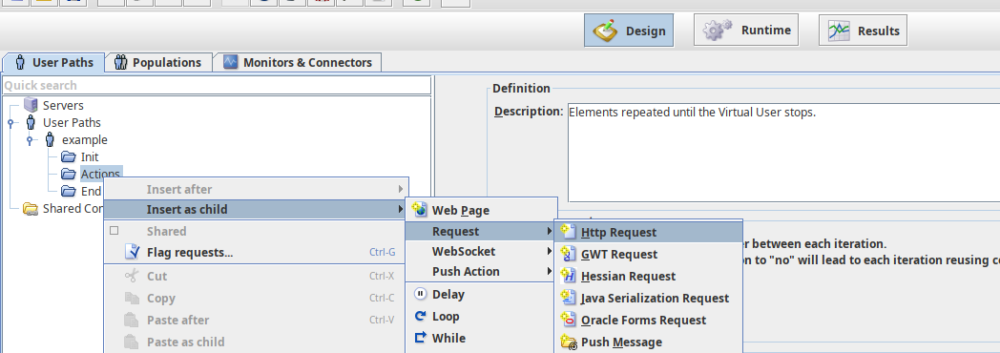

		1. In the HTTP Request dialogue type the following and click Create
			```
			GET http://TDT-Server:80/TableName/ColumnName
			```
			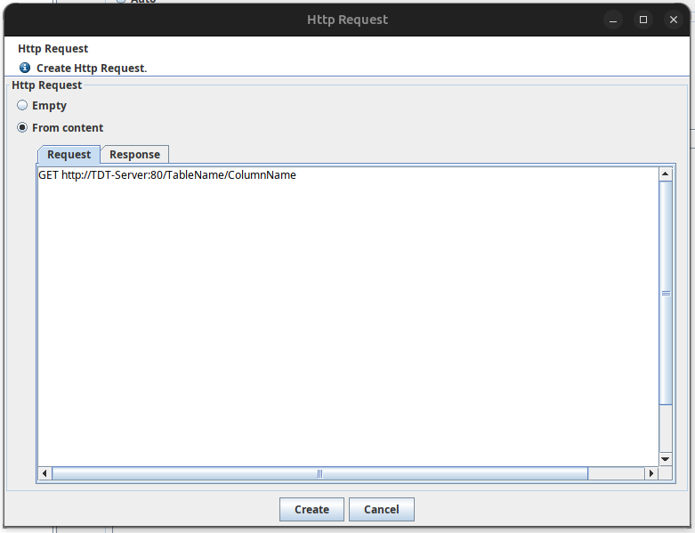

		1. Back in the Design screen, select the HTTP Request object and then click the Advanced button
			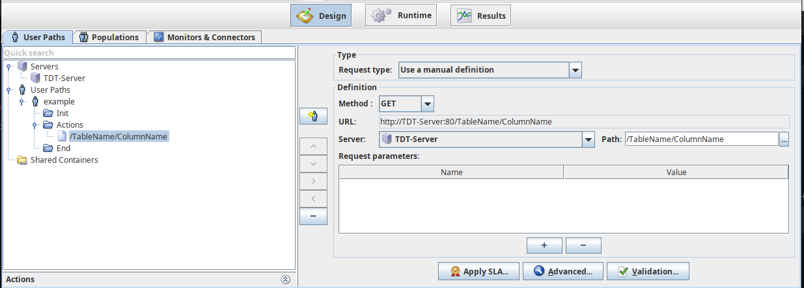

		1. In the Advanced window, select the Variable Extractors tab, the click the plus [+] button to add a Variable Extractor
			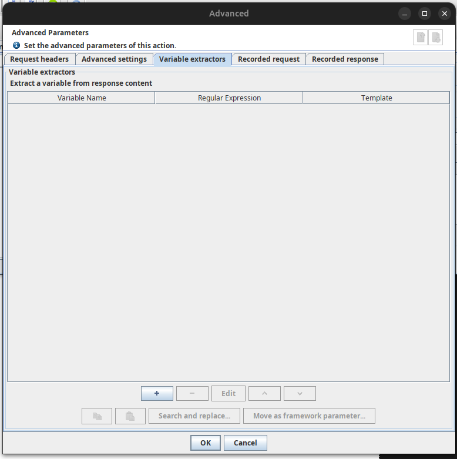

		1. In the Variable Extractor screen:
			- Enter a Variable name
			- enable the Expression checkbox
			- select the JSONPath option
			- Use the JSON Path `$..ColumnName`, if the column name you want the value for has spaces or if you wish to use a variable for the column name the you might need to use bracket notation e.g. `$..['Column Name']` or  `$..['${ColumnNameVariable}']`

			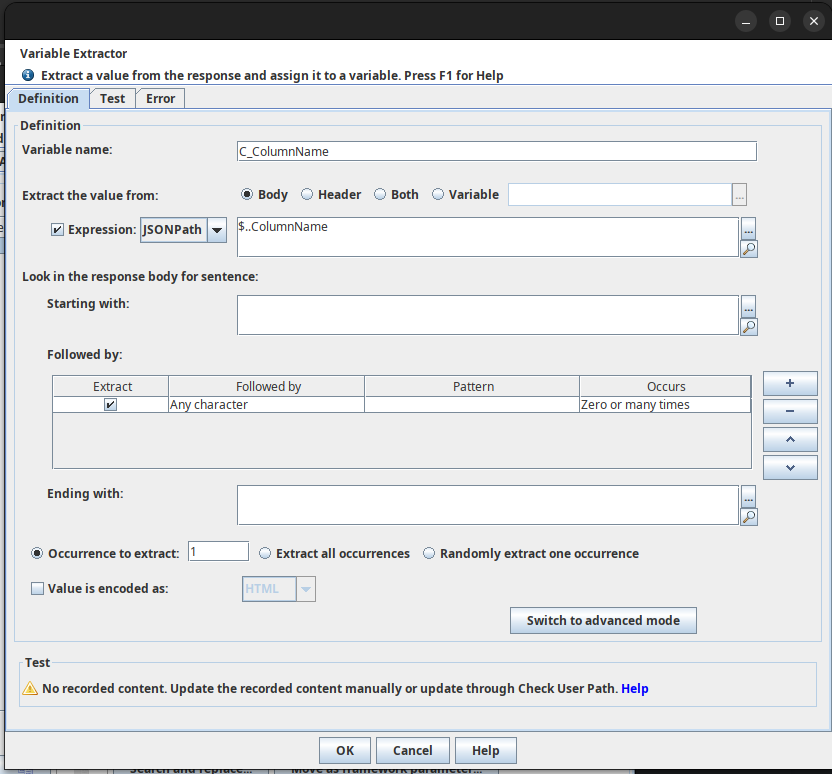

	1. Sending a value to a TDT column

		1. Right click the Container or Transaction where you want to get the value(s) from TDT and select Insert as child, Request, HTTP Request
			

		1. In the HTTP Request dialogue type the following and click Create
			```
			PUT http://TDT-Server:80/TableName/ColumnName/Value
			```
			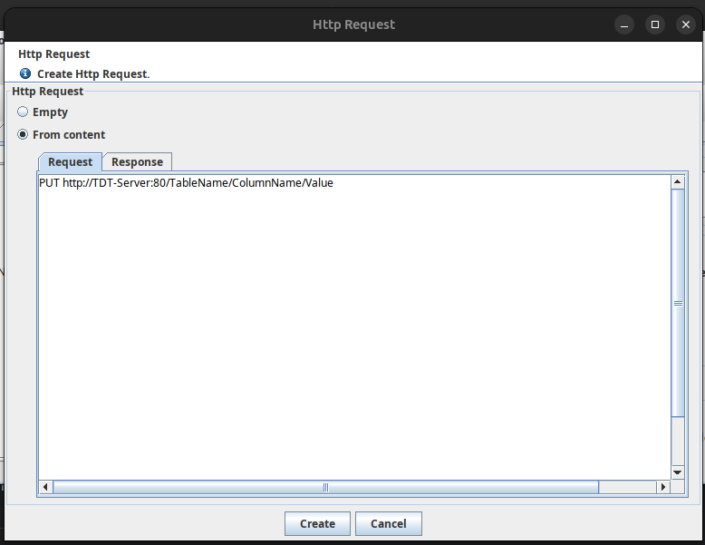

1. (Optional) Using variables, this might make your life easier.

	1. Open NeoLoad's Variable Manager
		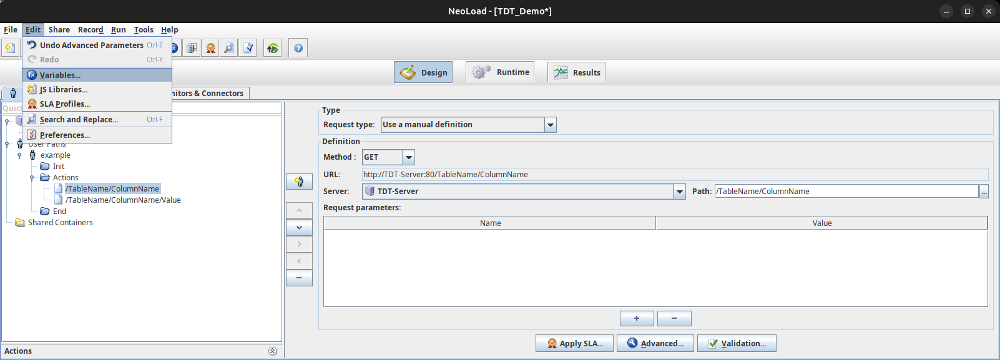

	1. Add variables as required, examples of Variables you might want are:
		- Test Data Table's Host Name
		- Test Data Table's Port Number
		- Your Table Name
		- Your Columns

		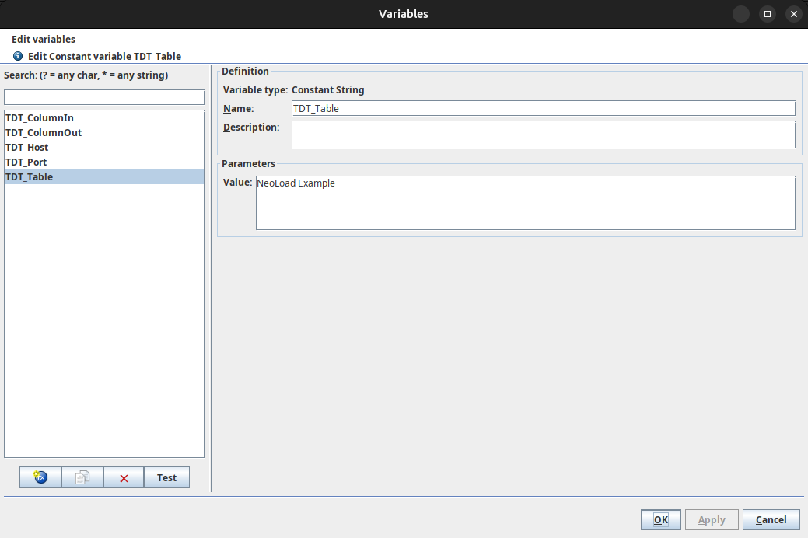

	1. Configure the Server difinition to use these variables, This initial Server definition that was automatically created for you:

		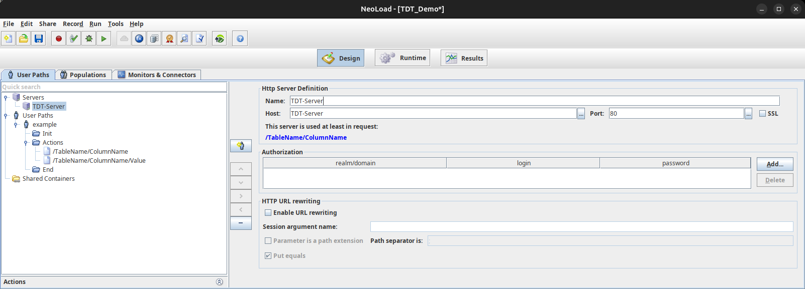

		becomes:

		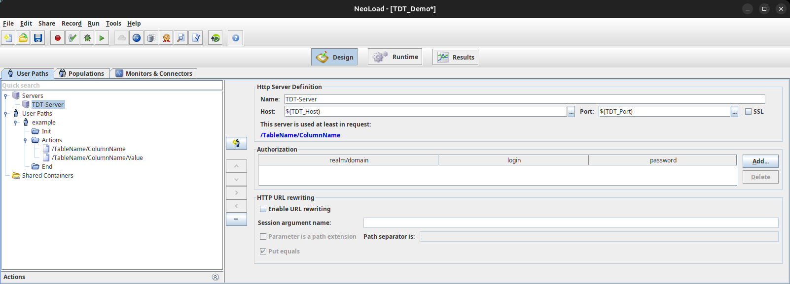

	1. Configure the GET request path to use the Table and Column variables:

		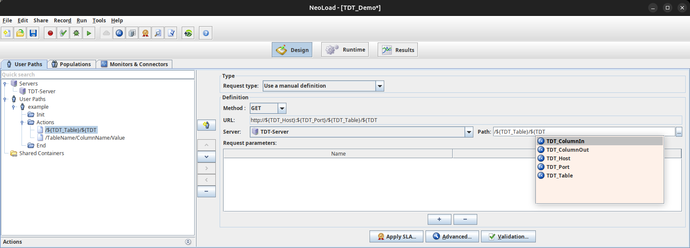

	1. Configure the variable extractor to use the Column variable:

		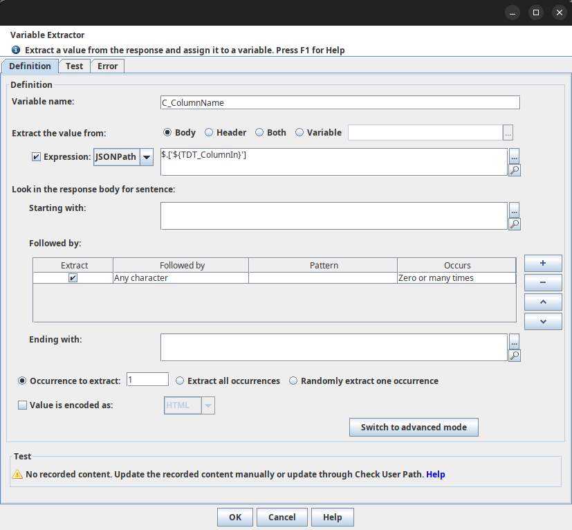

	1. Configure the PUT request path to use the Table, Column and Value variables:

		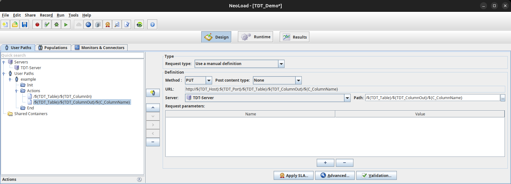
